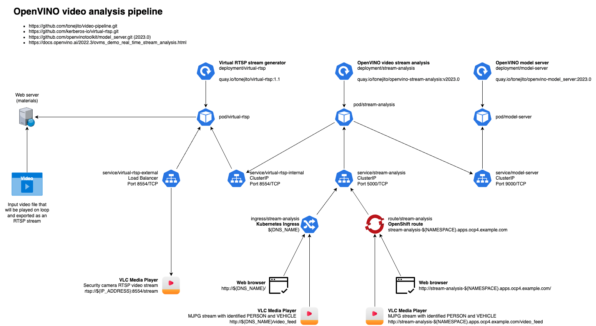

# Video processing pipeline

| 
|:------------------------------------------------:|
| OpenVINO video realtime stream analysis pipeline

This AI video processing pipeline implementation uses an MP4 source file that is converted to an RTSP stream with the code from `virtual-rtsp`.

- <https://github.com/kerberos-io/virtual-rtsp>

It is based on the Python `real_time_stream_analysis` demo from OpenVINO model server.

- <https://docs.openvino.ai/2022.3/ovms_demo_real_time_stream_analysis.html>
- <https://github.com/openvinotoolkit/model_server>

You need to download the BIN and XML files of the `person-vehicle-bike-detection-2002` OpenVINO model to process the RTSP video stream.

- <https://storage.openvinotoolkit.org/repositories/open_model_zoo/2022.1/models_bin/2/person-vehicle-bike-detection-2002/FP32/person-vehicle-bike-detection-2002.bin>
- <https://storage.openvinotoolkit.org/repositories/open_model_zoo/2022.1/models_bin/2/person-vehicle-bike-detection-2002/FP32/person-vehicle-bike-detection-2002.xml>

You can use any video that presents people walking on the street and cars passing by.
Those are identified in the analysis step and a box is drawn around them:

- Green box for people
- Blue box for vehicles

<!--
https://streams.videolan.org/samples/
-->

The input MP4 file needs to be `512x512` since that video format is required by the `real_time_stream_analysis.py` program.
This program was sightly modified to accept a bind address for the visualizer HTTP endpoint.

- `real_time_stream_analysis-python.patch`

--------------------------------------------------------------------------------

There is an included `Makefile` that can be used to execute each component of the pipeline in a separate terminal.

1. Play the source MP4 file in loop and present a virtual RTSP stream in port 8554.

```
$ make rtsp
```

2. Download the model that is used for processing the video.

```
$ make get-model
```

3. Execute the OpenVINO model server and set up an gRPC endpoint in port 9000.
   The model is downloaded if it is not present.

```
$ make openvino-model-server
```

4. Launch the video stream analysis logic and expose the HTTP visualizer endpoint in port 5000.

```
$ make openvino-stream-analysis
```
